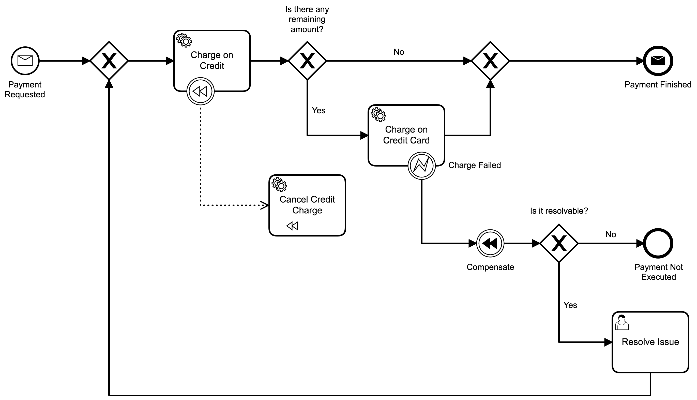
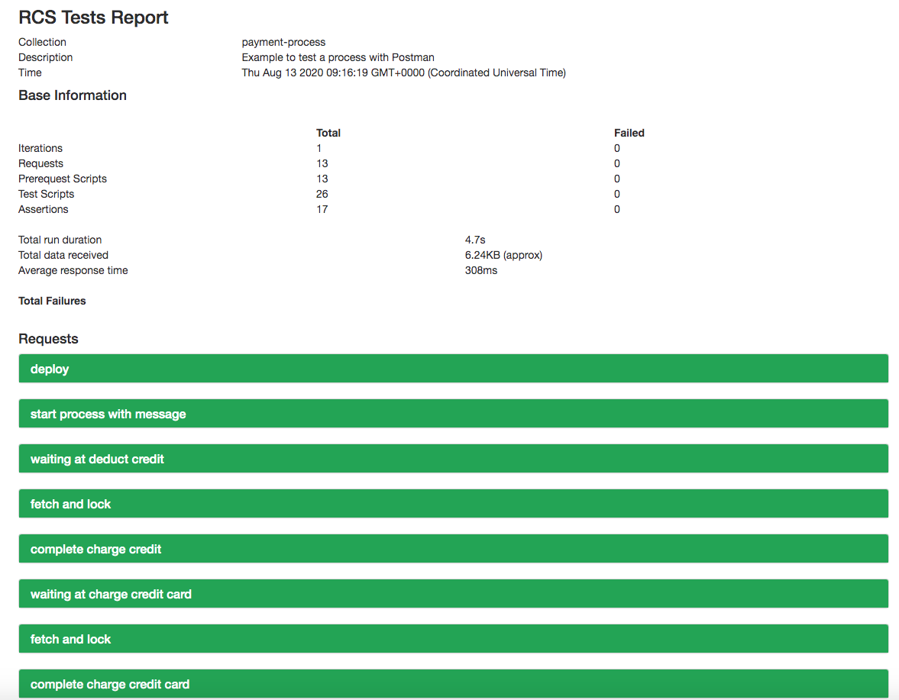

# Camunda Unit Tests with C#
A sample project that uses unit testing with newman (postman cli) and docker to test a Camunda process.

It is strongly based in the solution found in this repository: https://github.com/DannyDainton/postman-docker

## Show me the important parts!
Process used as part of the sample:

## How does it work?
This project is based in the script "run.sh" that does the following: 
1. Builds a [docker image](dockerimage/Dockerfile) that runs both Camunda and Newman.
2. Runs a docker container based on the image previously created. The main script executed is [this one](dockerimage/run.sh).
3. After the container is finished executing, the container is deleted.

The folder [dockerdata](dockerdata) contains some files that are necessary for the test, such as:
1. [Postman collection](dockerdata/payment-process.postman_collection.json): This is the collection that is executed in postman. You can modify the collection in postman according to your needs.
2. [Postman environment](dockerdata/payment-process.postman_environment.json): This is the environment that is used in postman. You can modify the environment in postman according to your needs.
3. [BPMN Process](dockerdata/process.bpmn):	The BPMN used in the test. You can
4. [Newman HTML Template](dockerdata/custom-template.hbs): The HTML template used to generate the HTML testing report. It was obtained [here](https://github.com/DannyDainton/postman-docker/blob/master/src/reports/templates/customTemplate.hbs).

You should see a HTML report in the folder "dockerdata/reports" with the results of the test.

## How to use it?
You can execute it by running the script [run.sh](run.sh).

A HTML testing report will be available in the folder "dockerdata/reports". Here is an example:

## Environment Restrictions

Tested with docker 19.03.5 in MacOS High Sierra (10.13.6).

* Camunda Run docker image: [Camunda Run 7.13.0](https://hub.docker.com/layers/camunda/camunda-bpm-platform/run-7.13.0/images/sha256-82869e702cae4b8c236fc5e1923524c3cf4ed864a78677ca470b9c4570ce3cb6?context=explore)
* Newman version: [5.1.2](https://www.npmjs.com/package/newman)

## Known Limitations

Only supports UNIX environments, since it uses SH scripts.

## Improvements Backlog

* Create a script to run it in Windows.
* Allow it to support multiple collections and processes.

## License
[Apache License, Version 2.0](http://www.apache.org/licenses/LICENSE-2.0).
